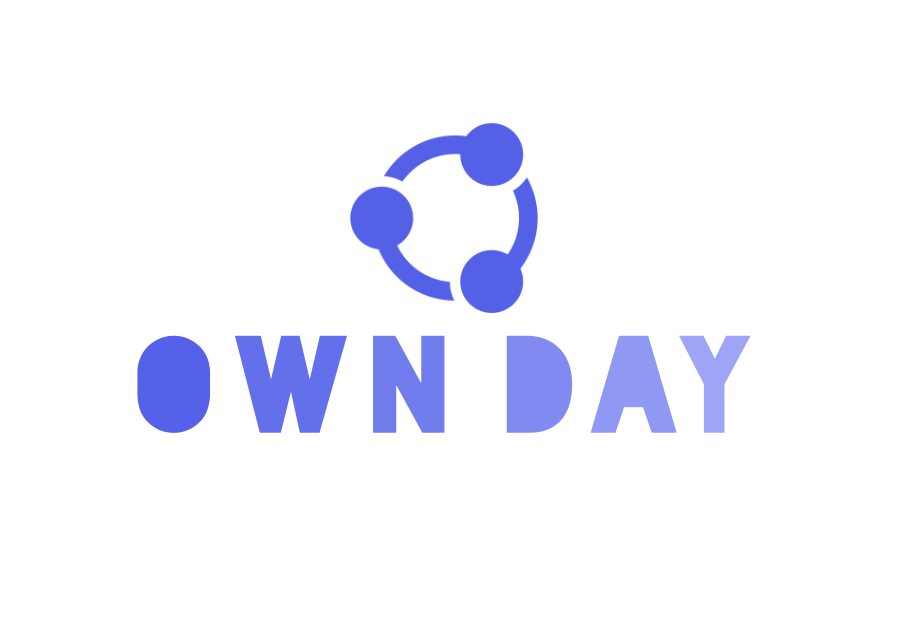

   
  
   
  <h1>Own Day</h1>

# 🔗Own Day 

[Own Day-Front 바로가기 :arrow_right:](https://github.com/HJ-dp/OwnDay-Front "Own Day 프론트엔드 파트")

[Own Day-Back 바로가기 :arrow_right:](https://github.com/HJ-dp/OwnDay-Front "Own Day 백엔드 파트")

## 📌목차 
- [개요](#개요)
- [멤버](#멤버)
- [주요기능](#주요기능)
- [기술스택](#기술스택)

## 📄개요 
- 프로젝트 이름 : Own Day
- 프로젝트 기간 : 2023.12 ~
